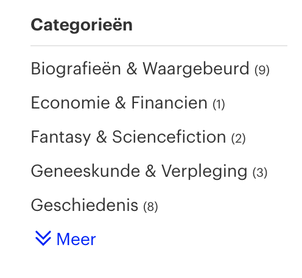
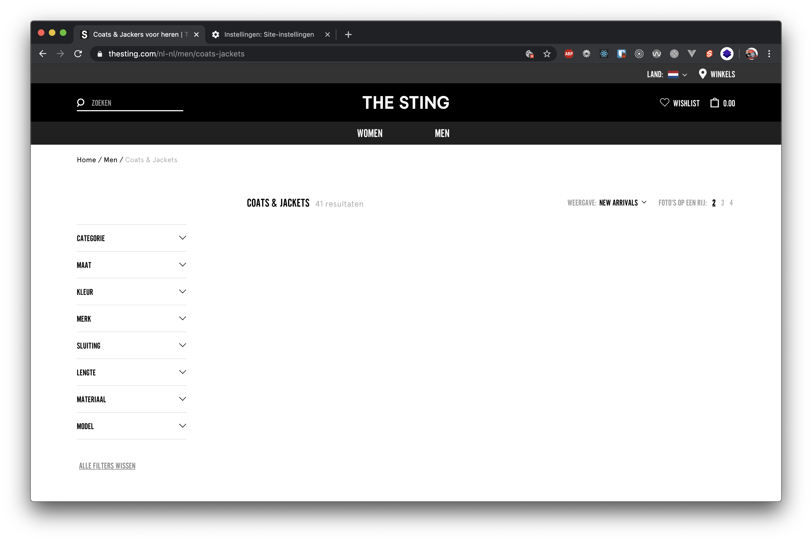

# Assignment 1.1 (Dutch)
> Check what happens to websites if certain features are not supported by user intent. I've chosen to check what happens to websites if JavaScript is disabled and what happens if cookies and or localStorage are disabled.

Wat gebeurd er met een website als de volgende zaken gebeuren:
1. Javascript uitzetten
2. Cookies niet accepteren

### Wat doet het met de website?
#### 1. Javascript uitzetten - Website: Bol.com
*Wat maakt het disabelen van de feature kapot?*
* Sommige afbeeldingen worden niet getoond
* Hamburger menu op mobiel kan ik niet openen
* Show more knopje bij categorieën werkt wel => dit is super sick met CSS opgelost, even showen
* De flow van het toevoegen van een product aan je winkelmandje is anders. Als je dit doet zonder JS wordt je naar je winkelmandje gestuurd, met JS opent een modal met een bevestiging die je dan kan sluiten.
* Ik ben wel de state kwijt dat m’n product is toegevoegd aan een winkelmandje, met JS veranderd het icoontje.

*Hoe kan je dit testen?*
Persoonlijk maak ik gebruik van een web dev extension in Chrome waardoor ik door 1 klik op de knop JavaScript kan uitzetten. Als je dan naar een website gaat is JavaScript uitgeschakeld.

*Hoe kan je dit eventueel fixen?*
Veel van de genoemde issues kan je fixen door een CSS checkbox-hack, wat ze dus wel heel mooi hebben gedaan bij de lijst met categorieën. Het toevoegen aan wishlist zou je op dezelfde manier kunnen fixen als dat ze het toevoegen aan winkelmandje hebben opgelost, om dan vervolgens de wishlist op te slaan op de server en die weer op te halen op de wishlist pagina.

#### 2. Cookies uitzetten - Website: The Sting
*Wat maakt het disabelen van de feature kapot?*
De content pagina’s van The Sting werken prima, alles wordt gewoon geladen. Echter, wanneer ik wil shoppen en een product pagina open zie ik geen producten. Dit is zowel zo met cookies uit als met JS uit… 😢

Je krijgt als je cookies uit hebt staan een localStorage error… wellicht dat het daar aan ligt. Ook heb ik geen mogelijkheid om de zoekfunctie te gebruiken met cookies die uit staan, dit ligt eerder aan de localStorage issue denk ik dan dat het ligt aan het uit hebben staan van cookies.

*Hoe kan je dit testen?*
Persoonlijk maak ik gebruik van een web dev extension in Chrome waardoor ik door 1 klik op de knop JavaScript kan uitzetten.

*Hoe kan je dit eventueel fixen?*
Het gemis aan localStorage zou je kunnen fixen door een soort mock te maken in je applicatie, ervan uitgaande dat JS wel is enabled. Die zou je dan kunnen gebruiken als een soort ’sessionStorage’ I guess. Als JS niet is enabled zou je alles weg kunnen schrijven naar de DB onder naam van de gebruiker en daar die data ophalen die nodig is. Hetzelfde geldt voor wanneer er een gemis is aan cookies. Het gemis aan cookies zou je eventueel ook nog kunnen oplossen door met elke URL een queryString mee te geven met de data die je anders in cookies zou plaatsen.