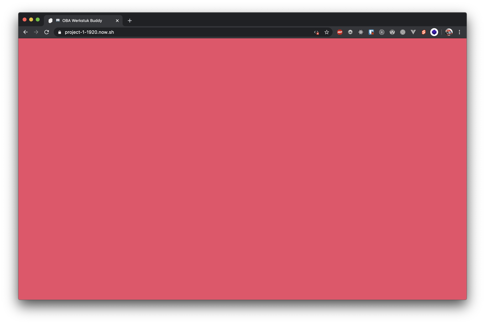
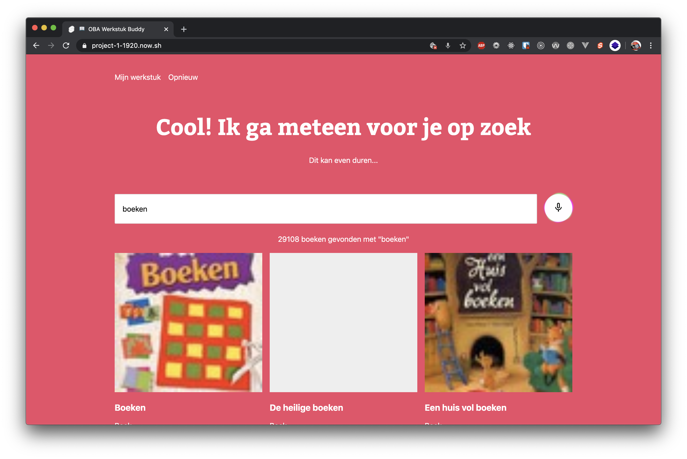
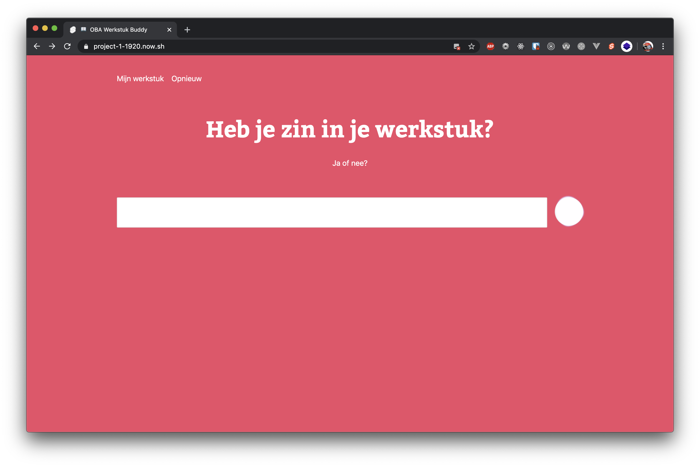
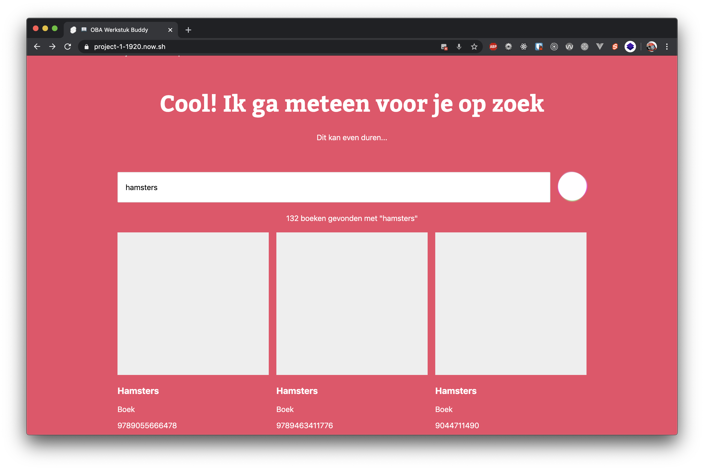
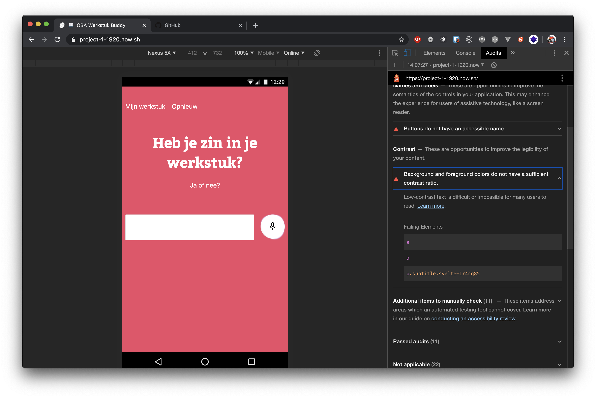
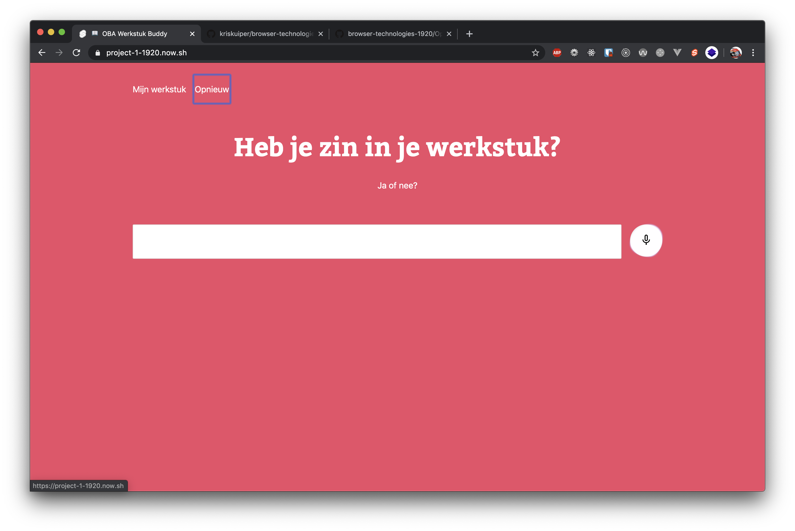
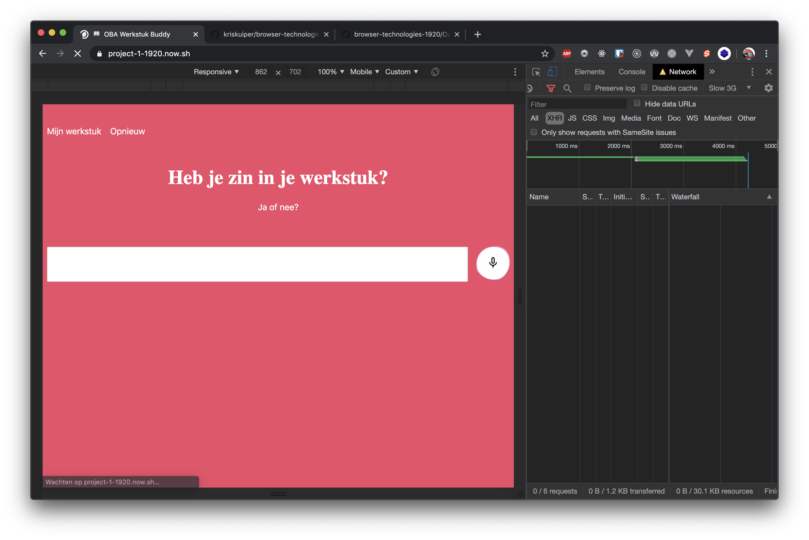

# Assignment 1.2 (Dutch)
> Test your OBA application on progressive enhancement and on legacy devices. Also you should test in multiple (legacy) browsers. Also test if you can use a screenreader on your application.

## 1. Testen van de features van opdracht 1.1

### 1.1. JavaScript uitzetten


Aangezien ik mijn applicatie heb gebouwd met client-side JavaScript krijg ik alleen een lege pagina te zien :sob:. Omdat JavaScript uitstaat, en juist m'n JavaScript code verantwoordelijk is voor het renderen van de DOM wordt er niks getoond.

#### Hoe te fixen?
Dit kan je simpelweg fixen door alles server-side te renderen. Ook maakt mijn applicatie gebruik van de Web-Speech API, dat betekent dat mijn hele applicatie, zelfs wanneer je de initiële HTML rendert op de server, niet zou werken. Een fix hiervoor zou zijn om het input in eerste instantie te laten werken als een form en een POST request te doen naar de server.

### 1.2. Cookies en localStorage uitzetten


Mijn applicatie maakt geen gebruik van cookies of localStorage. Hierdoor heeft het uitzetten ervan geen verdere gevolgen voor mijn applicatie.

#### Hoe te fixen?
Het gebrek aan cookies zorgt er eveneens voor dat je niet een server-side session zou kunnen gebruiken. Die fix kan je dus niet gebruiken. 

Een lelijke fix voor cookies tijdens de huidige session is het gebruik van queryparams, die zou je heen en weer kunnen passen tussen de client en de server, totdat de gebruiker de pagina verlaat uiteraard.

Een fix voor het gemis aan localStorage zou zijn dat je het alléén gebruikt wanneer het beschikbaar is:

```js
if (window.localStorage) {
    // Do fancy localStorage things
}

// Default, do nothing
```

### 1.3. Afbeeldingen uitzetten


Als ik de afbeeldingen op mijn applicatie uit zet verlies ik mijn loading state van de 'luister' button. De afbeeldingen bij de resultaten worden ook niet weergegeven waardoor het terugvalt op de grijze achtergrond. Hierdoor gaat de layout zelf niet kapot.



#### Hoe dit netter te fixen?
Die loading state zou ik eveneens ergens in tekst kunnen weergeven, zodat het altijd duidelijk is dat de applicatie aan het luisteren is. Persoonlijk vind ik dat het niet tonen van de afbeeldingen zo netjes is opgelost, wat ik nog wel zou kunnen doen is de `alt` van een afbeelding weer kunnen geven in een pseudo element van de afbeelding:

```html

```

```css
img {
    position: relative;
    width: 100%;
    height: 100%;
}

img:before {
    content: attr(alt);
    position: absolute;
    top: 0;
    left: 0;
}
```

Hierdoor wordt de alt alsnog getoond, ondanks dat er geen afbeeldingen (en alt tags with them) getoond kunnen worden.

### 1.4. Kleur uitzetten / kleurenblindheid


Om dit te testen heb ik niet alleen gekeken hoe de website er in zwart-wit uit ziet, maar heb ik eveneens een audit laten draaien door Google Lighthouse (zie onderstaand). Hoewel het naar mijn mening in het zwart-wit nog allemaal prima uit ziet geeft de audit aan dat de contrast ratio van de tekst en achtergrond niet voldoende is.

#### Hoe dit te fixen?
Om dit te fixen kan ik ervoor zorgen om de achtergrond een donkere of fellere kleur rood te geven.

### 1.5. Custom fonts uitzetten
Als ik custom fonts uitzet op mijn applicatie wordt er direct het fallback font getoond. Omdat ik gebruik maak van `font-display: swap` zal de gebruiker nooit last hebben van een FOIT.

#### Hoe dit te fixen?
Is al gefixt joe.

### 1.6. Muis / trackpad werkt niet


Omdat ik de default focus styles heb toegevoegd is mijn applicatie eenvoudig te besturen met het keyboard. Waar het wel penibel wordt is op de resultatenlijst. Gebruikers kunnen dan niet boeken toevoegen aan hun werkstuk... Daarnaast heeft de 'luister' button geen focus styles.

#### Hoe te fixen?
Ik zou een button kunnen maken van elk resultaat in de resultatenlijst maar weet niet of dat semantisch correct is. Ik vind persoonlijk van niet... Een andere oplossing zou zijn om de articles een `tabindex=0` mee te geven.

### 1.7. Traag / geen internet


Om dit te testen heb ik de network laten throttlen door de developer tools van Chrome. Als je een trage internetverbinding hebt duurt het langer voor de custom fonts en de resultaten om te laden. Als je geen internet hebt wordt er niks getoond.

#### Hoe te fixen?
Service worker gebruiken om zoveel mogelijk static assets te cachen.