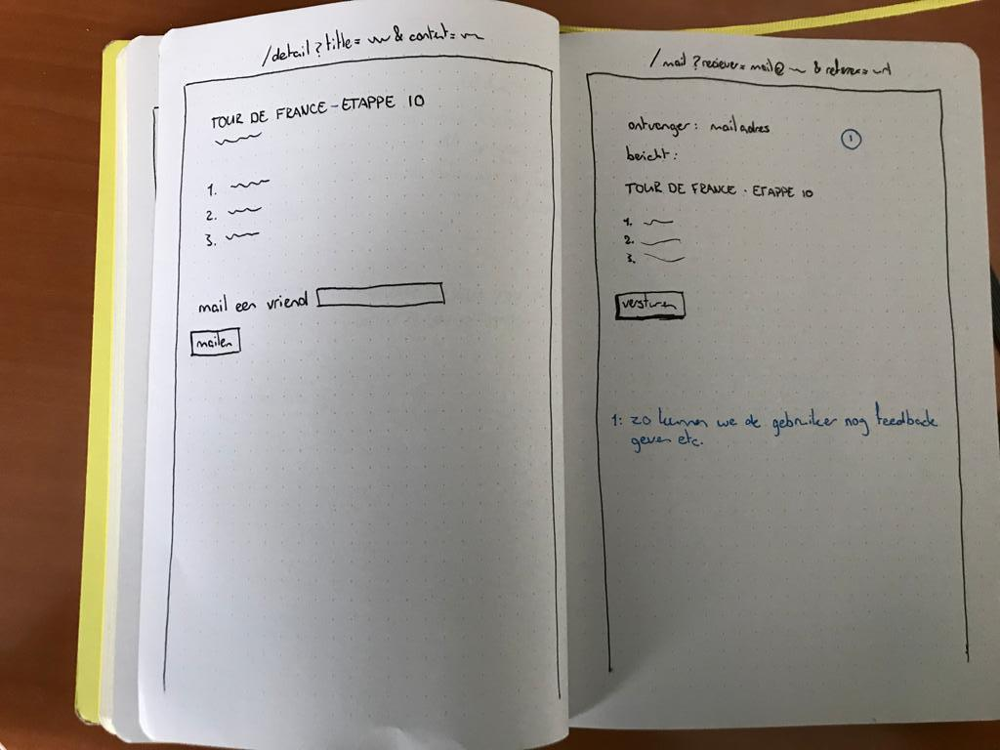
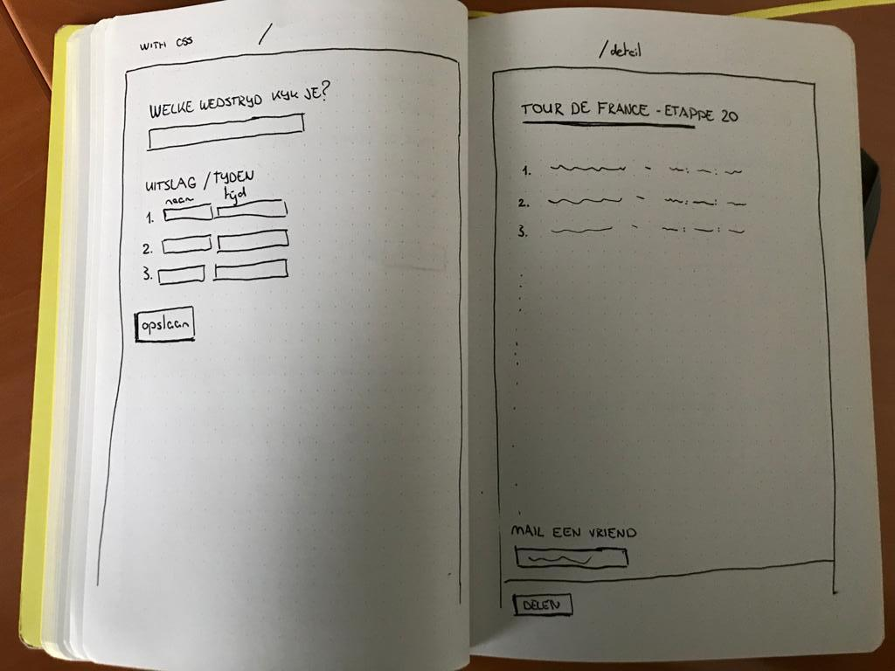

# Browser technologies assignment 2
> Work out a case and make the functionality work for every user; regardless of context, browser, device or input type.

Dit project is een Express (Node JS) applicatie omdat ik voor mijn oplossing het e.e.a. aan server-side logica nodig heb. Zo maak ik bijvoorbeeld in de meest simpele versie veel gebruik van queryparams om de opgeschreven uitslagen deelbaar te maken.

## Gekozen use case:
> Ik wil de scores of tijden van een sportwedstrijd kunnen bijhouden tijdens de wedstrijd en opslaan en doorsturen

## Features
Mijn case heeft de volgende drie features nodig om de core functionaliteit te ondersteunen:
1. Bekijken / bijhouden van uitslagen
2. Het opslaan van uitslagen zodat het later teruggekeken kan worden
3. Het doorsturen van je notities naar anderen

## Enhancement van de features
Onderstaand een beschrijving van hoe de features uitgewerkt zijn in elke laag. Al dan niet met wat schetsen om de werking van de features duidelijk te maken.

### Functional / reliable
Deze laag is bruikbaar voor alles en iedereen, dingen zien er voor geen meter uit maar de core functionaliteit is te gebruiken.




#### 1. Bijhouden van scores / tijden
De gebruiker kan via een `<input type="text" />` de naam van de wedstrijd neerzetten en in een `textarea` de uitslagen / tijden neerzetten.

#### 2. Het opslaan van notities
De gebruiker kan op een 'opslaan' button klikken om hun notities (danwel tussentijds danwel aan het eind) op te slaan. De data wordt verstuurd naar een database. ~~Hiervoor moet de gebruiker echter wel eerst inloggen?~~

#### 3. Doorsturen van uitslagen / tijden naar anderen
Hier kunnen we queryparams gebruiken om alle content op te slaan, die link, inclusief query params kunnen gebruikers dan delen met vrienden, hierdoor staat die content altijd op de pagina omdat we de query uitlezen.

### Usable
Met deze usable laag gaan we er vanuit dat we o.a. CSS tot onze beschikking hebben waardoor we al wat geavanceerdere design patterns toe kunnen passen en het gebruik van de applicatie al een stukje beter maken.




#### 1. Bijhouden van scores / tijden
De flow blijft hier in principe hetzelfde alleen ziet het er een stuk overzichtelijker uit omdat we gebruik kunnen maken van de vormgevingsprincipes in een formulier en bijvoorbeeld de labels en velden onder elkaar te zetten.

#### 2. Het opslaan van notities
Notities kunnen nog steeds niet 'echt' opgeslagen worden, daarvoor hebben we danwel session cookies of localStorage nodig. Liefst session cookies dus zodat we het op de server kunnen afhandelen en nog steeds geen JS nodig hebben.

#### 3. Doorsturen van uitslagen / tijden naar anderen
Gebruikers kunnen eveneens op dezelfde manier zoals in de vorige laag uitslagen en tijden doorsturen naar anderen.

### Pleasurable
Alles gaat uit de kast, we hebben toegang to alles wat het web ons biedt waaronder client-side JavaScript, cookies, localStorage, zieke CSS dingen en nog veel meer.


#### 1. Bijhouden van scores / tijden
Hier kunnen we nu een soort van progressive disclosure aan toevoegen door de gebruiker op een plusje te laten klikken als ze een volgende plaats willen invullen. Ook kan de gebruiker tussentijds opslaan en altijd door wanneer die wilt als we deze pagina opslaan in de cache en dus ook offline kunnen serveren.

#### 2. Het opslaan van notities
Het opslaan van notities is bovenstaand al een beetje beschreven, echter. We kunnen nu ook de user session gebruiken om de huidige lijst met notities op te slaan en te tonen op een andere gebruiker.

#### 3. Doorsturen van uitslagen / tijden naar anderen
Gebruikers kunnen nu via native sharing op mobiel door navigator.share de boel delen. Als dit niet ondersteund wordt valt 'ie terug op de oudere versie van hoe dit in de vorige laag werkte.

## Over progressive enhancement
Het principe progressive enhancement gaat erover dat je je applicatie als het ware opbouwt in verschillende lagen, waarbij je in eerste instantie de 'slechtste' browser en / of het slechtste device in acht neem en ervoor zorgt dat de core functionaliteit van je applicatie dan alsnog werkt.

Daarna kan je gaan kijken of je zogenaamde enhancements (toffere dingen) toe kan voegen aan je applicatie om de user experience ervan te versoepelen en te verbeteren.

Hoe ik dit in mijn applicatie toe pas is bijvoorbeeld dat zolang er geen JavaScript is, ik zoveel mogelijk leun op (server-side) web technieken en de gebruiker eigenlijk van pagina naar pagina gaat. Wanneer er echter wel JavaScript beschikbaar is, werkt mijn applicatie haast als een Single Page Application waarbij de gebruiker vrijwel nooit van pagina naar pagina gaat (uiteraard d.m.v. feature detection en fallbacks, daarover hieronder meer).

## Over feature detection
Feature detection borduurt eigenlijk voort op het idee van progressive enhancement. Je gaat hierbij specifiek kijken of bepaalde JavaScript en / of CSS features ondersteund worden binnen de context waarin je website op dat moment draait.

Waneer er in de context die ene toffe feature wordt ondersteund maak je daar gebruik van, en anders zorg je ervoor dat je applicatie terug valt op een zogenaamde 'fallback'. Die fallback kan vanalles zijn, een aantal voorbeelden uit mijn applicatie zijn bijvoorbeeld dat ik met m'n CSS het volgende doe:

```css
/* Eerder in de stylesheet, een fallback op float als flex niet ondersteund wordt */
.stage-page__classification {
    float: left;
    text-align: center;
    font-size: 12px;
    width: 50%;
    text-transform: uppercase;
    font-weight: 700;
    border: 1px solid black;
}

/* Gebruik maken van feature detection om te kijken of display: flex ondersteund wordt */
@supports (display: flex) {
    .stage-page__list {
        display: flex;
        justify-content: center;
        flex-wrap: wrap;
    }

    /* Overschrijven van de float want flex wordt ondersteund */
    .stage-page__classification {
        float: none;
    }
}
```

Voor het tonen van notificaties, wat alleen met JavaScript kan, heb ik bijvoorbeeld ervoor gezorgd dat de 'toon notificaties knop' standaard disabled is, en dat de tekst iets is als "Kan op dit moment geen notificaties sturen". 

Als er CSS is haal ik de knop zelfs helemaal uit het scherm en als er dan vervolgens wel JavaScript is toon ik de knop weer, enable ik 'm en verander ik de tekst. Hieronder de implementatie in JavaScript:

```js
const notificationIsAvailable = Boolean(window.Notification)
const notificationButton = document.getElementById('js-notify-button')

if (notificationIsAvailable && notificationButton) {
    notificationButton.removeAttribute('disabled')
    notificationButton.classList.remove('is--hidden')
    notificationButton.textContent = 'Keep me updated'
    notificationButton.addEventListener('click', handleNotificationPermission)
}
```

Een ander deel waarbij ik feature detection heb gebruikt is om het delen van de uitslagen zo soepel mogelijk te laten verlopen. Tegenwoordig kan je namelijk, in ieder geval op telefoons, gebruik maken van `Navigator.share` wat app-like sharing in je applicatie brengt. Echter, op een laptop kan je dit niet gebruiken... Daar moet ik dus een fallback voor hebben:

```js
const nativeShareIsAvailable = typeof Navigator.share === 'function'
const requestIsAvailable = typeof XMLHttpRequest !== null && typeof XMLHttpRequest !== undefined

function handleShare(event) {
    // Als ze beiden niet ondersteund worden is het gewoon een linkje
    // naar de /share pagina waar het formulier staat en je een e-mail
    // in kan vullen
    if (requestIsAvailable || nativeShareIsAvailable) {
        event.preventDefault()
    }

    // Joejoe, we hebben native share, laten we er gebruik van maken
    if (nativeShareIsAvailable) {
        return Navigator.share({
            title: 'Standings in the Tour de France',
            text: 'I like you to watch the standings in the current stage in the tour de france',
            url: window.location.href
        })
    }

    // Display form contents in a below the share buttons
    displayFormContents(event.target)
}
```